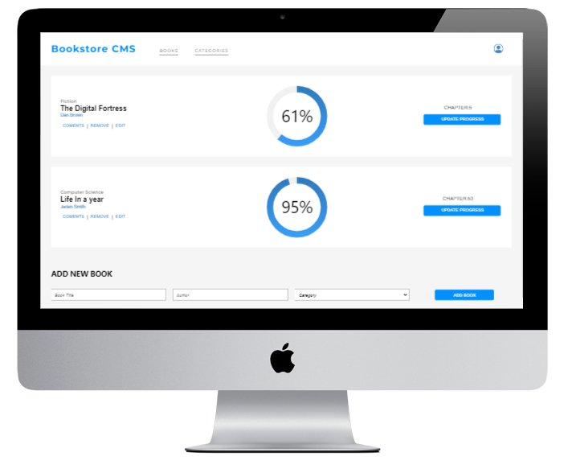

  
   

  <h3><b>Microverse README Template</b></h3>

<!-- TABLE OF CONTENTS -->

# 📗 Table of Contents

- [📖 About the Project](#about-project)
  - [🛠 Built With](#built-with)
    - [Tech Stack](#tech-stack)
  - [🚀 Live Demo](#live-demo)
- [💻 Getting Started](#getting-started)
- [👥 Authors](#authors)
- [🤝 Contributing](#contributing)
- [⭐️ Show your support](#support)
- [🙏 Acknowledgements](#acknowledgements)
- [📝 License](#license)

<!-- PROJECT DESCRIPTION -->

# 📖 Bookstore 

**Bookstore** is a website that allows you to: Display a list of books. Add a book. Remove a selected book. All the data is saved in an external API . This project has been built with React and Redux.

  

## 🛠 Built With 

### Tech Stack 

  
Client

  <ul>
    <li><a href="https://reactjs.org/">React.js</a></li>
    <li><a href="https://react-redux.js.org/">Redux</a></li>
  </ul>

  
Server

  <ul>
    <li><a href="https://webpack.js.org/">Webpack.js</a></li>
  </ul>

<!-- LIVE DEMO -->

## 🚀 Live Demo 

- [Live Demo](https://react-bookstore-marurevi.netlify.app/)

(<a href="#readme-top">back to top</a>)

<!-- GETTING STARTED -->

## 💻 Getting Started 

This project was bootstrapped with [Create React App](https://github.com/facebook/create-react-app).

## Available Scripts

In the project directory, you can clone the repository with the following link:
`https://github.com/marurevi/React-Bookstore.git`

 Once you have clone the repository run:
 `npm install`
 to install all the dependencies that you need.
 Then you can run a live version with the command `npm start`.

(<a href="#readme-top">back to top</a>)

<!-- AUTHORS -->

## 👥 Authors 

👤 **Mariana Revilla Lérida**

- GitHub: [@marurevi](https://github.com/marurevi)
- Twitter: [@MaruRevilla](https://twitter.com/MaruRevilla)
- LinkedIn: [Mariana-Revilla-Lérida](https://linkedin.com/in/mariana-revilla-l%C3%A9rida-a12aba143)

(<a href="#readme-top">back to top</a>)

<!-- CONTRIBUTING -->

## 🤝 Contributing 

Contributions, issues, and feature requests are welcome!

Feel free to check the [issues page](../../issues/).

(<a href="#readme-top">back to top</a>)

<!-- SUPPORT -->

## ⭐️ Show your support 

Give a ⭐️ if you like this project!

(<a href="#readme-top">back to top</a>)

<!-- ACKNOWLEDGEMENTS -->

## 🙏 Acknowledgments 

> Give credit to everyone who inspired your codebase.

I would like to thank...

(<a href="#readme-top">back to top</a>)

<!-- LICENSE -->

## 📝 License 

This project is [MIT](./LICENSE) licensed.

(<a href="#readme-top">back to top</a>)

